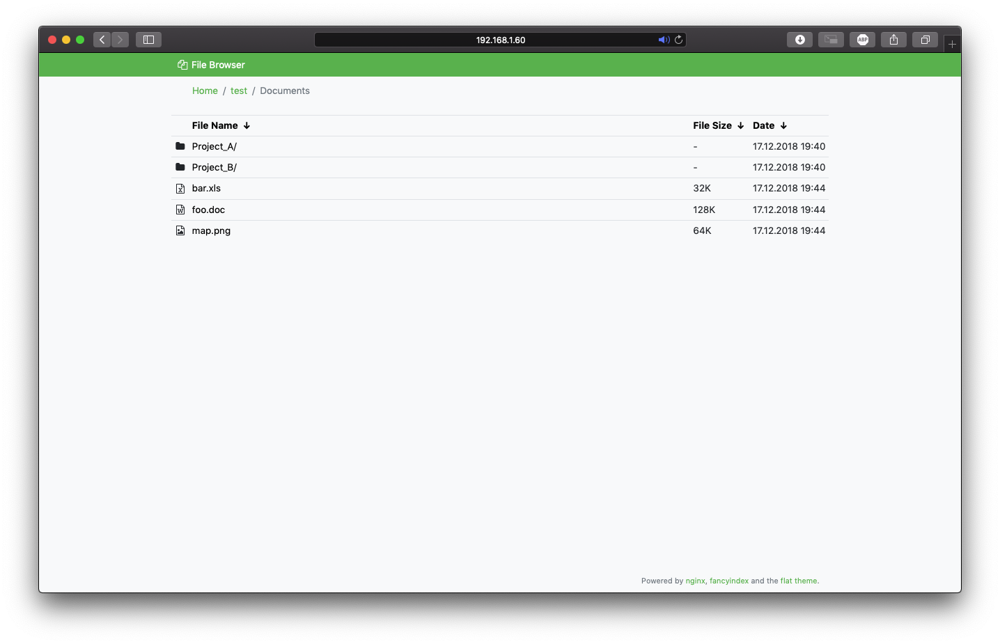

# Flat theme for nginx's fancyindex module

[](https://github.com/alehaa/nginx-fancyindex-flat-theme/issues)
[](LICENSE)




## About

The [fancyindex module](https://github.com/aperezdc/ngx-fancyindex) of
[nginx](http://nginx.org/) has the powerful capability to be customizable.
Instead of using an external application, this gives us the ability to use use
just the webservers capabilities to generate beautiful directory listings.

This theme provides a simple, flat interface based on
[Bootstrap 4](https://getbootstrap.com), [Font Awesome](https://fontawesome.com)
and (for easy navigation in galleries)
[lightbox2](http://lokeshdhakar.com/projects/lightbox2/). In combination with
the browser's preview capability, accessing the majority of files should be
possible, giving the user easy access without a single line of server-side
dynamic code.


## Usage

1. Get the latest ressources from [GitHub releases](https://github.com/alehaa/nginx-fancyindex-flat-theme/releases)
   or build them on your own by running `make` inside this repository and copy
   these files into any location accessible by *nginx*.
2. Configure your vhost to use the theme's ressources for fancyindex:
    ```
    # Fancyindex
    fancyindex             on;
    fancyindex_header      "/theme/header.html";
    fancyindex_footer      "/theme/footer.html";
    fancyindex_show_path   off;
    fancyindex_name_length 255;
    fancyindex_exact_size  off;
    fancyindex_localtime   on;

    location /theme {
        alias /srv/www/fileserver/theme;
    }
    ```
3. To enable image thumbnails, configure nginx to generate and cache if neccessary:
    ```
    # 3.1. thumbnail images cache (outside server block)
    proxy_cache_path /tmp/nginx-images-cache/ levels=1:2 keys_zone=images:10m inactive=30d max_size=1024m;

    # 3.2 separate server to serve thumbnails internally
    server {
        # Internal image resizing server.
        server_name localhost;
        listen 8181;

        root /srv/www/fileserver;

        location ~ ^(?i)/thumbs/(.+)-([0-9]+)x([0-9]+)\.(jpg|jpeg|png|gif|webp)$ {
                image_filter_buffer 30M; # Will return 415 if image is bigger than this
                image_filter_jpeg_quality 80; # Desired JPG quality
                image_filter_interlace on; # For progressive JPG
                image_filter resize $2 $3;
                alias '/srv/www/fileserver/$1.$4';
        }
    }

    # 3.3 location should be within main server block to serve thumbnails outside
    location ~ ^/thumbs {
            proxy_pass 'http://127.0.0.1:8181/$uri';
            proxy_cache images;
            proxy_cache_valid 200 30d;
            proxy_cache_key $scheme$proxy_host$uri;
    }
    ```

## License

The nginx-fancyindex-flat-theme is free software: you can redistribute it and/or
modify it under the terms of the GNU General Public License as published by the
Free Software Foundation, either version 3 of the License, or (at your option)
any later version.

This software is distributed in the hope that it will be useful, but **WITHOUT
ANY WARRANTY**; without even the implied warranty of **MERCHANTABILITY** or
**FITNESS FOR A PARTICULAR PURPOSE**. A Copy of the GNU General Public License
can be found in the [LICENSE](LICENSE) file.

&copy; 2018 Alexander Haase
